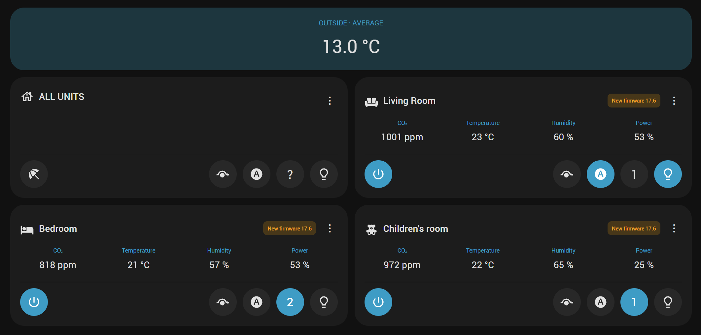

# RecuAir Home Assistant Integration

Monitor and control [Recuair DC40](https://www.recuair.com/) ventilation units in [Home Assistant](https://www.home-assistant.io/) through their local web interface. Requires **Home Assistant 2026.9.0 or later**.

- **Readings:** CO₂, room and outdoor temperature, humidity, ventilation intensity, filter life, operating mode and light intensity.
- **Controls:** auto, off, holiday, bypass and manual levels 1–4; native Home Assistant lighting with on/off, brightness and RGB color, plus a 0–5 light-intensity control.
- **Maintenance:** firmware updates and filter-service reminders, with confirmation before updates or filter resets. Filter reminders also appear under **Settings → Repairs**.
- **Optional dashboard:** room cards, history and controls for individual units or all units together.

## Installation

Both methods install the integration and its bundled dashboard. Local control requires no internet connection.

### HACS (recommended)

[](https://my.home-assistant.io/redirect/hacs_repository/?owner=tprochazka&repository=recuair-home-assistant-integration&category=integration)

1. [Install and configure HACS](https://www.hacs.dev/docs/use/download/download/) if needed.
2. Click **Open in HACS** and add the repository, or add `https://github.com/tprochazka/recuair-home-assistant-integration` under HACS **Custom repositories**, category **Integration**.
3. Download **RecuAir DC40**, restart Home Assistant, then follow [Configuration](#configuration).

### Manual installation

1. Download `recuair.zip` from the [latest release](https://github.com/tprochazka/recuair-home-assistant-integration/releases/latest).
2. Extract it into `/config/custom_components/recuair/`, so the manifest is at `/config/custom_components/recuair/manifest.json` without an extra directory level.
3. Restart Home Assistant, then follow [Configuration](#configuration).

The buttons in this README open Home Assistant screens; they do not install or configure anything automatically.

## Configuration

[](https://my.home-assistant.io/redirect/config_flow_start/?domain=recuair)

1. Under **Settings → Devices & Services**, confirm automatically discovered DC40 units. For manual setup, click **Add integration** above or choose **Add Integration → Recuair**.
2. Enter the unit's **Host** (local IP address, e.g. `192.168.1.123`) and **Scan Interval** (default **60 seconds**, minimum **10 seconds**).
3. Repeat for each unit. Change the interval later using **Configure** on its integration entry.

## Optional custom dashboard



The dashboard JavaScript loads automatically with the integration. No separate frontend installation or Resources entry is needed; standard Home Assistant entities also work independently.

1. Choose **Edit dashboard → Add card**, search for **RecuAir Dashboard** and add it. Reload the browser if the card is not listed after installation.
2. For a full-width page, use a view with **Panel (1 card)** layout. See [dashboard/recuair.yaml](dashboard/recuair.yaml) for a complete example, or use this card in YAML:

```yaml
type: custom:recuair-dashboard
```

Cards appear automatically for configured units and use Home Assistant room names and icons. The outdoor temperature average excludes unusually high readings. Open a room card for history; long-press its light button for brightness and color. The all-units card appears with **two or more units**. Labels follow the Home Assistant profile language: Czech or English.

Polling runs every **10 seconds while the dashboard is visible**, returning to the configured interval when all dashboards are hidden or closed. Firmware and filter chips provide access to maintenance actions; reset filter reminders after replacing the filters.

## Updates

HACS offers updates from **tagged releases**, not development-branch commits. Install the update and restart Home Assistant, then reload open dashboards. Manual users should replace `/config/custom_components/recuair/` with the latest release ZIP contents and restart.

The integration and dashboard update together; existing unit and dashboard configuration is retained.

## Development

Run the checks and build the package locally:

```sh
python -m pip install -r requirements-test.txt
python -m unittest discover -s tests -v
node --check custom_components/recuair/frontend/recuair-dashboard.js
node tests/test_dashboard.cjs
python scripts/build_package.py
```

Tests use fixtures and Home Assistant stubs; they do not contact units or verify the full Home Assistant runtime. GitHub Actions runs these checks on pushes and pull requests. Its artifacts are development builds; installable releases are published from version tags matching `manifest.json`.

## Credits and license

Based on [pavelkrejsa/recuair](https://github.com/pavelkrejsa/recuair) and NightMean's [PR #3](https://github.com/pavelkrejsa/recuair/pull/3), which added HACS-compatible layout and discovery. This fork adds controls, maintenance and the bundled dashboard. Licensed under [MIT](LICENSE).
